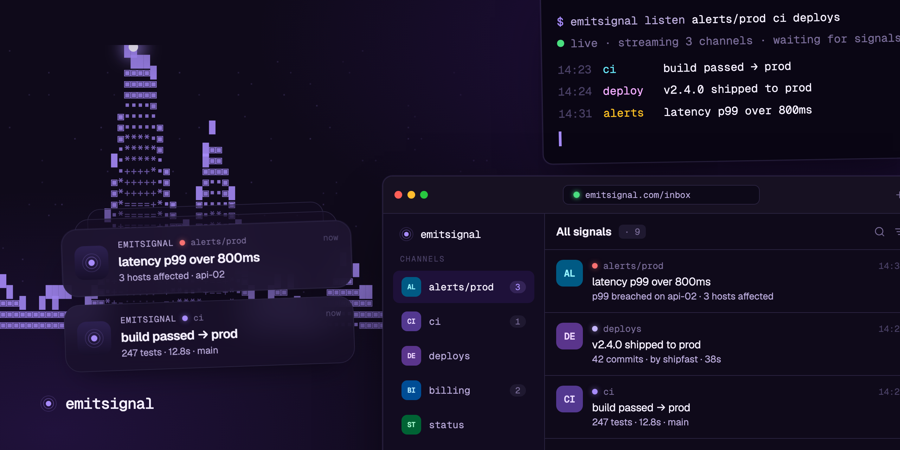

<p align="center">
  
</p>

<h2 align="center">Real-time notifications, from your shell to your phone</h2>

<p align="center">Pipe alerts, deploys and CI straight to your phone — emit a signal from anything that can run <code>curl</code>.</p>

<p align="center">
  <a href="#quick-look">Quick look</a> ·
  <a href="#features">Features</a> ·
  <a href="#packages">Packages</a> ·
  <a href="#getting-started">Getting started</a> ·
  <a href="#architecture">Architecture</a>
</p>

<br />

# What is EmitSignal?

EmitSignal is a self-hostable, real-time notification platform built for developers. Publishers `POST` messages to named **topics**; subscribers receive them **live** over Server-Sent Events in the web dashboard and mobile app, and as **push notifications** on their phone. Emails and push are dispatched asynchronously through queued workers, so publishing stays fast.

No SDK required to send — if it can make an HTTP request, it can emit a signal. The publish API is [ntfy](https://ntfy.sh)-style: set everything through headers and skip the JSON.

<br />

# Quick look

Two ways to send a signal: `curl` needs nothing installed, the CLI is nicer to live in.

<details open>
<summary><strong>With curl</strong> — works from anything that can make an HTTP request</summary>

<br />

**Publish a message** — header-based, no body parsing required:

```bash
curl -X POST https://emitsignal.com/publish/alerts \
  -H "X-Title: Deploy finished" \
  -H "X-Priority: high" \
  -H "X-Tags: ci,prod" \
  -d "v2.4.0 shipped to production"
```

**Or send JSON, authenticated with an API key:**

```bash
curl -X POST https://emitsignal.com/publish/alerts \
  -H "Authorization: Bearer es_your_api_key" \
  -H "Content-Type: application/json" \
  -d '{ "title": "Latency alert", "body": "p99 over 800ms", "priority": 5, "tags": ["prod"] }'
```

**Subscribe and stream signals live** over SSE:

```bash
# one topic
curl -N https://api.emitsignal.com/topics/alerts/listen

# several at once, replaying the last 10 minutes first
curl -N "https://api.emitsignal.com/listen?topics=alerts,ci,deploys&since=$(($(date +%s000) - 600000))"
```

**Schedule for later** — relative durations (`30m`, `2h`, `1d`) or a unix timestamp:

```bash
curl -X POST https://emitsignal.com/publish/reminders \
  -H "X-Title: Stand-up in 30 minutes" \
  -H "X-Delay: 30m" \
  -d "Don't forget the daily"
```

</details>

<details>
<summary><strong>With the CLI</strong> — <code>emitsignal</code>, aliased to <code>es</code></summary>

<br />

**Install** — a single static binary, no runtime required:

```bash
npm i -g @emitsignal/cli

# or the install script
curl -fsSL https://github.com/emitsignal/emitsignal/releases/latest/download/install.sh | sh
```

**Authenticate once** — writes a token to `~/.emitsignalrc`:

```bash
es login
```

**Publish a message** — the title defaults to the first line of the body:

```bash
es publish alerts "v2.4.0 shipped to production" \
  --title "Deploy finished" \
  --priority 4 \
  --tag ci,prod
# ✓ published → alerts · cmt4hcs5m000001t64ujxh3m5 · 73ms
```

**Subscribe and stream signals live:**

```bash
# one topic
es listen alerts

# every subscription, replaying the last 10 minutes first
es listen --since 10m

# glob a channel, and only surface high-priority signals
es listen --channel "alerts/*" --priority ">=4"
```

**Point it at a self-hosted instance:**

```bash
es config set-url https://signals.internal.example.com
```

Scheduling is header-only for now — `es publish` has no `--delay` flag yet, so use the
`curl` form above for delayed signals.

</details>

<br />

# Features

- **Topics** — `POST /publish/<topic>` to any named topic; subscribers tune in by name, no pre-registration. Topic names may contain slashes (`alerts/prod`, `ci/web`).
- **Live delivery (SSE)** — `GET /topics/:name/listen` or `GET /listen?topics=a,b,c`, both with `?since=` backlog replay and heartbeats.
- **Push notifications** — delivered to the Expo mobile app (iOS, Android) via queued workers.
- **Priorities** — `1`–`5`, or the aliases `min` / `low` / `default` / `high` / `urgent`.
- **Tags & actions** — categorize with `X-Tags`, attach interactive `X-Actions` to a message.
- **Scheduling** — `X-Delay` accepts relative durations (`5m`, `2h`, `1d`, `1w`) or a unix timestamp, up to a year out.
- **Webhooks** — receive from external services at `POST /h/:slug` with built-in templates for `github`, `grafana`, `stripe`, `vercel`, and `custom`.
- **Attachments** — upload files alongside a message, stored locally or on S3.
- **Flexible auth** — magic link, passkey (WebAuthn), API keys (`es_…`), and optional GitHub and Apple sign-in, via [Better Auth](https://better-auth.com).
- **Rate limiting** — per-IP and per-user limits, backed by Redis, fail-open if Redis is down.
- **Email digests** — transactional emails through a pluggable provider (`log`, `smtp`, or [Resend](https://resend.com)).

# Packages

This is a [Bun](https://bun.com) workspace monorepo.

| Package                                                        | Description                                          |
| -------------------------------------------------------------- | ---------------------------------------------------- |
| [`@emitsignal/server`](./packages/emitsignal-server)           | Elysia API — topics, auth, SSE, queued delivery      |
| [`@emitsignal/website`](./packages/emitsignal-website)         | TanStack Start web dashboard                         |
| [`@emitsignal/mobile`](./packages/emitsignal-mobile)           | Expo React Native app (iOS, Android, Web)            |
| [`@emitsignal/cli`](./packages/emitsignal-cli)                 | Terminal client — publish and stream from your shell |
| [`@emitsignal/shared`](./packages/emitsignal-shared)           | Shared TypeScript types and API client               |
| [`@emitsignal/emails`](./packages/emitsignal-emails)           | React Email templates                                |
| [`@emitsignal/docs`](./packages/emitsignal-docs)               | Mintlify documentation site (CLI & API reference)    |
| [`@emitsignal/docker`](./packages/emitsignal-docker)           | Docker Compose stack for local dev and deployment    |
| [`@emitsignal/e2e-testing`](./packages/emitsignal-e2e-testing) | Playwright end-to-end tests                          |

<br />

# Getting started

You'll need [Bun](https://bun.com) `>= 1.3` and [Docker](https://docs.docker.com/get-docker/).

```bash
bun install
docker compose -f packages/emitsignal-docker/docker-compose.dev.yml up
```

That brings up the whole stack with hot reload — PostgreSQL, Redis, an SMTP inbox ([localhost:3134](http://localhost:3134)), all BullMQ workers, the API server ([localhost:5100](http://localhost:5100)) and the website ([localhost:5173](http://localhost:5173)).

<details>
<summary>Run pieces by hand (without Docker)</summary>

```bash
# API + workers
cd packages/emitsignal-server
cp .env.example .env          # edit DATABASE_URL, REDIS_URL, etc.
bun run db:migrate && bun run db:seed
bun run dev:worker            # all workers (separate terminal)
bun run dev                   # API server

# web dashboard
cd packages/emitsignal-website && bun run dev

# mobile app
cd packages/emitsignal-mobile && bun run start
```

</details>

Workspace-wide scripts run from the root: `bun format`, `bun lint`, `bun test`, and `bun dev` (runs `dev` in every package).

<br />

# Architecture

```
┌─────────────┐              ┌─────────────┐              ┌─────────────┐
│   Website   │  SSE/HTTP    │   Server    │   BullMQ     │   Workers   │
│  (TanStack) │ ◄──────────► │  (Elysia)   │ ────────────► │ email/push/ │
└─────────────┘              └──────┬──────┘              │  schedule   │
                                    │                      └──────┬──────┘
┌─────────────┐              ┌──────┴──────┐                     │
│   Mobile    │  SSE/HTTP    │  PostgreSQL  │              ┌──────┴──────┐
│  (Expo/RN)  │ ◄──────────► │  + Redis    │              │   Email     │
└─────────────┘              └─────────────┘              │  Provider   │
                                                           │ smtp/resend │
                                                           └─────────────┘
```

A publish immediately fires an in-process event bus (powering live SSE) and enqueues a push job; scheduled messages skip the bus and go straight to the schedule queue. Dedicated workers drain the `email`, `push`, and `schedule` queues so the publish path never blocks on delivery.

### Built with

[Bun](https://bun.com) · [Elysia](https://elysiajs.com) · [Prisma](https://www.prisma.io) + PostgreSQL · [Redis](https://redis.io) + [BullMQ](https://bullmq.io) · [Better Auth](https://better-auth.com) · [TanStack Start](https://tanstack.com/start) · [Expo](https://expo.dev) / React Native · [React Email](https://react.email) · Tailwind CSS · TypeScript
